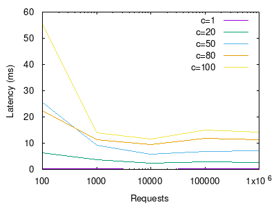
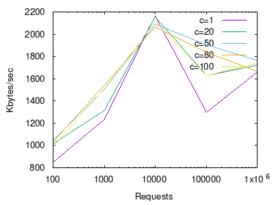
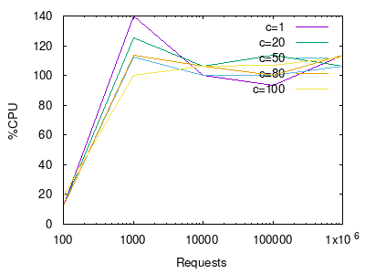
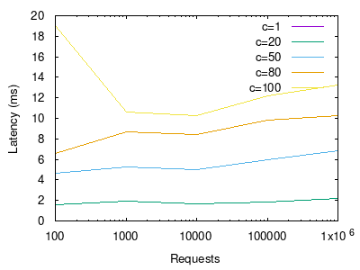
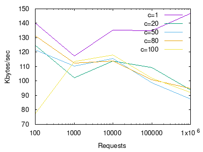
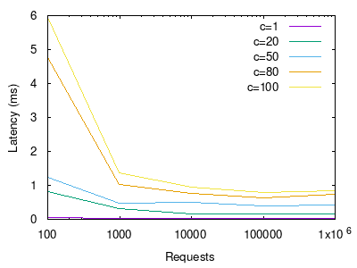
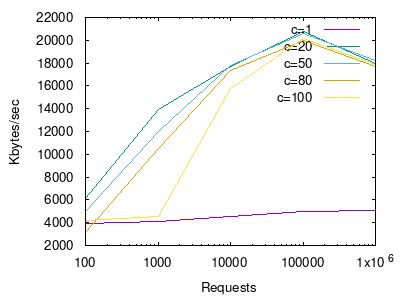
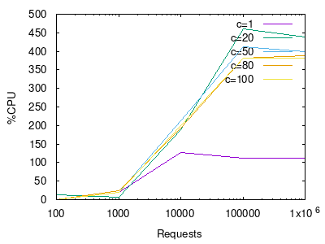

# Benchamark Task


## Benchamark ab with nodejs server

In order to perform the ab benchmark, first a server is created. First a nodejs server will tested. Navigate to the node-server folder and execute the command to start the nodejs server at port 3000:

```console
node src/index.js
```
To start the benchmark execute:

```console
./benchmark_ab.sh node
```

This will generate 100, 1000, 10000, 100000 and 1000000 requests to the server with concurrencies of 1, 20, 50, 80 and 100 requests. The following results for the time response, Transfer rate and cpu usage can be seen below for all the cases.

The following script generates te plots:

```console
./postProcessing.sh
```


### Response Time in milliseconds

|Requests | c=1  | c=20 | c=50  | c=80 | c=100|
| ------ | :---: | :---: | :---: | :---: | ----: |
|100|0.372|6.289|25.646|22.491|55.372|
|1000|0.228|3.600|9.229|11.221|13.860|
|10000|0.114|2.306|5.743|9.529|11.687|
|100000|0.134|2.835|6.956|11.973|15.080|
|1000000|0.139|2.762|7.196|11.293|14.207|




Looking at the plot we can see how the latency as a function of the number of requests behaves. We can see how as the concurrency increases the response time also increases. This is beacause the server tries to handle all the requests at the same time and this results in a higher latency.

### Transfer per second 


|Requests | c=1  | c=20 | c=50  | c=80 | c=100|
| ------ | :---: | :---: | :---: | :---: | ----: |
|100|851.12|1017.85|1046.53|1031.29|989.09|
|1000|1238.24|1313.05|1508.85|1541.05|1515.28|
|10000|2163.08|2155.12|2089.33|2064.89|2114.25|
|100000|1297.85|1630.61|1905.21|1838.19|1631.29|
|1000000|1659.52|1722.93|1761.21|1667.82|1740.82|



In this case we can see the Kybtes/second transfered as a function of the number of requests, here we see not much  difference between all the concurrency cases. We can see how there is a peak at 10000 requests with higher requests and with higher requests the transfer rate starts decresing because of the high stress of the server.

### CPU usage

|Requests | c=1  | c=20 | c=50  | c=80 | c=100|
| ------ | :---: | :---: | :---: | :---: | ----: |
|100|12.5|12.5|12.5|12.5|18.8|
|1000|140.0|125.0|112.5|113.3|100.0|
|10000|100.0|106.2|100.0|106.2|106.2|
|100000|93.3|113.3|100.0|100.0|106.7|
|1000000|113.3|106.2|106.2|113.3|112.5|



Here we see the cpu usage of the server as a function of the cpu%, in this case the cpu usage is around 100% because the nodejs server only uses 1 core of the cpu.


## Benchamark goab with nodejs server


In this case we will test the goab benchmark in the nodejs server. To start the benchmark execute:

```console
./benchmark_goab.sh node
```

It will genertae the same tables as before.

### Response Time in milliseconds

|Requests | c=1  | c=20 | c=50  | c=80 | c=100|
| ------ | :---: | :---: | :---: | :---: | ----: |
|100|0.000|1.5400|4.650|6.575|19.020|
|1000|0.004|1.964|5.286|8.655|10.607|
|10000|0.002|1.699|4.974|8.420|10.252|
|100000|0.002|1.801|5.935|9.81|12.201|
|1000000|0.0030|2.206|6.838|10.221|13.277|




For the time response we obtain similar results as before.


### Transfer per second 


|Requests | c=1  | c=20 | c=50  | c=80 | c=100|
| ------ | :---: | :---: | :---: | :---: | ----: |
|100|140.076|124.892|121.736|131.554|77.299|
|1000|117.258|102.366|110.317|112.457|113.367|
|10000|135.318|114.025|115.647|113.860|118.058|
|100000|134.751|109.257|98.905|100.796|102.091|
|1000000|147.010|93.981|87.566|94.896|91.946|



The TPS we obtain diferent results as the ab, this is because in this case the Kbytes/sec calculated are only the html bytes transfered, where in the case of the ab benchmark all the bytes are taken into account.


The cpu usage is also the same as before, around 100%.


## Benchamark ab with golang server

To start the golang server, from the golang-server folder start it like so:

```console
go run main.go
```

This will serve it at port 3000. Then the benchmark is created with the folling command:

```console
./benchmark_ab.sh main
```

### Response Time

|Requests | c=1  | c=20 | c=50  | c=80 | c=100|
| ------ | :---: | :---: | :---: | :---: | ----: |
|100|0.000000|1.540000|4.650000|6.575000|19.020000|
|1000|0.004000|1.964000|5.286000|8.655208|10.607000|
|10000|0.002100|1.699200|4.974000|8.420600|10.252300|
|100000|0.002480|1.801760|5.935940|9.811310|12.201730|
|1000000|0.003040|2.206412|6.838320|10.221145|13.277293|



In this case we can see how the golang server respond much faster at concurrent requests as the nodejs server.

### TPS

|Requests | c=1  | c=20 | c=50  | c=80 | c=100|
| ------ | :---: | :---: | :---: | :---: | ----: |
|100|3946.70|6115.46|4944.62|3177.10|4210.46|
|1000|4106.01|13959.62|12019.23|10546.03|4531.88|
|10000|4532.90|17735.73|17756.49|17357.25|15732.77|
|100000|4981.58|20743.97|20631.47|19997.88|20133.65|
|1000000|5026.51|17994.82|18242.16|17715.74|17890.19|



The bytes transfered / second are much higher also, except for the case of no concurrency at all. The peak at this case is at 100000 requests.


### CPU

|Requests | c=1  | c=20 | c=50  | c=80 | c=100|
| ------ | :---: | :---: | :---: | :---: | ----: |
|100|0.0|12.5|0.0|0.0|0.0|
|1000|18.8|6.2|18.8|25.0|18.8|
|10000|126.7|187.5|213.3|193.8|200.0|
|100000|112.5|460.0|412.5|381.2|381.2|
|1000000|112.5|437.5|400.0|387.5|381.2|




We can see how in the case of the golang server it uses around 400% of the cpu, this means that 4 cores are used in this case when there is concurrency.